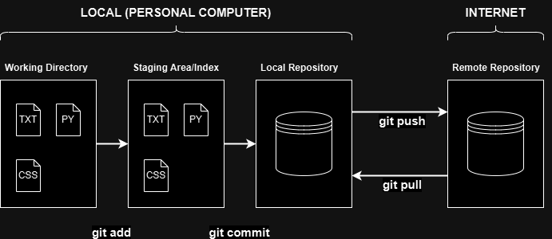
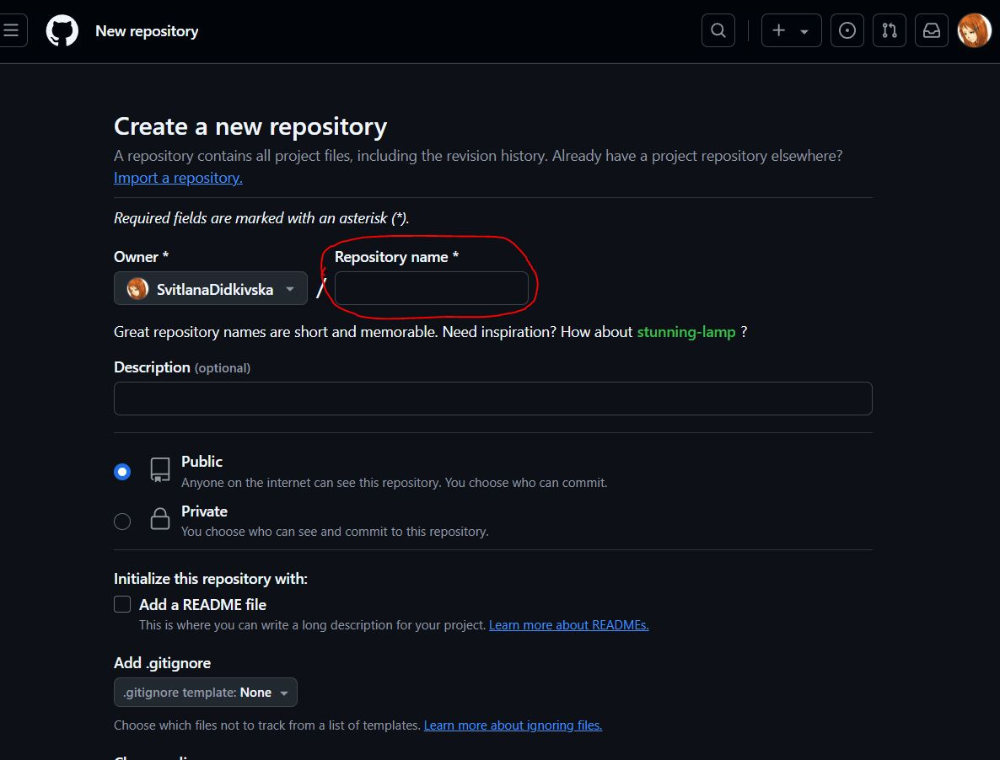
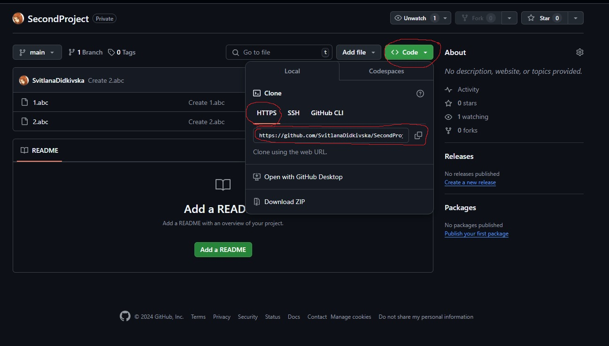
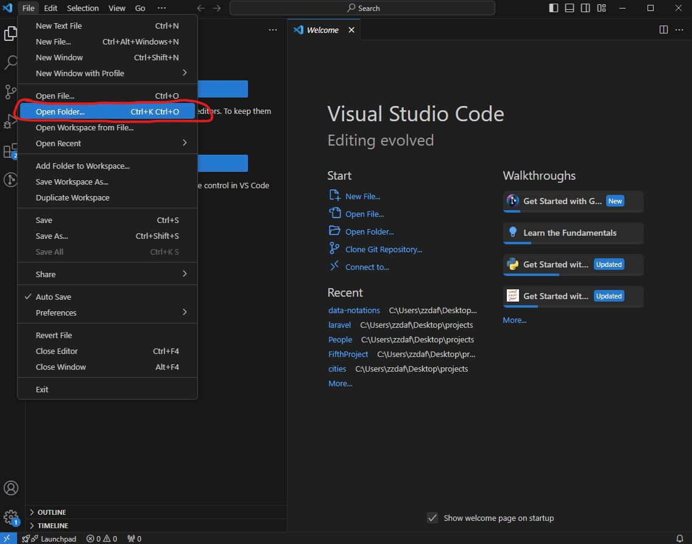
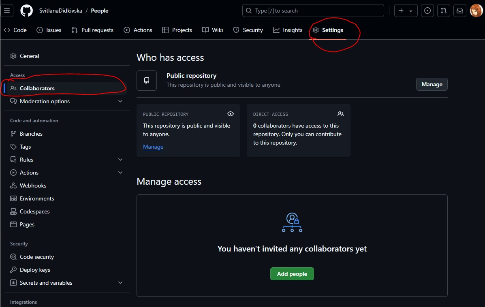

<!--
(c) Janusz Stal
Krakow University of Economics
Department of Informatics
stalj@uek.krakow.pl
-->

# DOCUMENT VERSION TRACKING

## 1. Git Installation and Configuration

1. Git is a free and open source distributed version control system which allows you to track changes to the files you create and modify. If you do not already have Git on your computer, an installer for various operating systems is available at:

    <https://git-scm.com/>

    You can find the user manual in many languages ​​at:

    <https://git-scm.com/book/en/v2>

    And some introduction in the following video:

    <https://youtu.be/r8jQ9hVA2qs?feature=shared>
    
1. Main Git Concepts:

    

1. To track changes to files, first you must provide your name and email. This information will be used to mark who made changes to the files.

    Launch a command line (terminal window). Then, execute the following Git commands. Replace the name and email with your data.

    ```
    git config --global user.name "Anna May"
    git config --global user.email "maya@gmail.com"
    ```

    Make sure Git is configured correctly. Display the list of settings and find your data (name and email):

    ```
    git config --list
    ```

## 2. Create Repository from Command Line

1. On your Windows desktop, create a folder called MyProjects. In this folder, create a folder for you first project called FirstProject. This is where you will work with your files and track changes.

1. Launch a command line (terminal window). Then, in the terminal window, go to the FirstProject folder. There are many ways to do this. Search online if you are not familiar with it.
    
    The terminal window should display a prompt with the FirstProject folder name at the end.

    PS C:/User/Desktop/MyProjects/**FirstProject**>
    
1. In the folder FirstProject, create a Git repository. To do this, execute the command:

    ```
    git init
    ```

    You will see a message displayed that an empty repository has been created. This means that a database has been created that will record any changes to your folder.

    ```
    Initialized empty Git repository in ...
    ```

## 3. Track Changes from Command Line

1. Create three sample files in your repository (1.abc, 2.abc and 3.abc). It does not matter what they contain. To create the files, run the commands:

    ```
    echo "" > 1.abc
    echo "" > 2.abc
    echo "" > 3.abc
    ```

    Start Windows Explorer and display the contents of the FirstProject folder. It is a good idea to arrange terminal and Windows Explorer windows on the monitor screen so that they do not cover each other. You will then be able to observe the changes in the folder after executing Git commands.   

1. Check the status of your repository. Execute the following command:

    ```
    git status
    ```

    Git informs you that the repository contains 3 files and they are not tracked yet. A hint is also provided on how to add your files to tracking.

    ```
    On branch master

    No commits yet

    Untracked files:
    (use "git add <file>..." to include in what will be committed)
            1.abc
            2.abc
            3.abc

    nothing added to commit but untracked files present (use "git add" to track)
    ```

1. Add files to track. Run the command below. The dot means you are adding all files to track.

    ```
    git add .
    ```

    Check your repository status again (execute git status). The files have been added to tracking and you can register changes to your folder in the Git database.

1. Register changes in your repository (in the folder FirstProject). Execute the Git command below, which records the state of your folder at a given point in time. When you register changes, you provide a short description to help distinguish the different states of your folder.

    ```
    git commit -m "I created three files"
    ```

1. Now create two more files 4.abc and 5.abc, enable tracking for them, and then log the changes made to the folder to the Git database. Execute the commands:

    ```
    echo "" > 4.abc
    echo "" > 5.abc
    git status
    git add .
    git status
    git commit -m "I added two more files"

1. Finally add one more file 6.abc and register changes to the folder.

1. Display the history of the three registered changes in  folder FirstProject. Execute the following command:

    ```
    git log
    ```

    As you can see, the three changes in the folder have been recorded. Each change contains a unique long identifier (after the word commit), the author of the changes, the date and time the changes were recorded, and your short comment. The last change to the folder is placed at the top of the list. The folder state marked with the word HEAD is currently valid in use. 


    ```
    commit c3ada05680d53cba899186f8fe2ad3f62af5407f (HEAD -> master)
    Author: John Brown <john@gmail.com>
    Date:   Mon Sep 16 18:38:35 2024 +0200

        I added last file

    commit 2ae5a6e1962f6a8f4c950007cad5504193b24bcf
    Author: John Brown <john@gmail.com>
    Date:   Mon Sep 16 18:38:12 2024 +0200

        I added two more files

    commit 6f2d257a255f57d6a435e980f06538fd62b451c2
    Author: John Brown <john@gmail.com>
    Date:   Mon Sep 16 18:24:19 2024 +0200

        I created three files
    ```

1. Suppose you want to return to some previous state of your folder, for example you are interested in the state of the folder when the first three files were in it. Execute the following command. It contains the folder state identifier (copy it from the folder change history).

    ```
    git checkout 6f2d257a255f57d6a435e980f06538fd62b451c2
    ```

    As you can see, the HEAD pointer has moved and the folder now contains only three files at 18:24. Check it in Windows Explorer.

    To return to the last state of the folder, execute the command:

    ```
    git checkout master
    ```

    Note: This command could vary in dependence of your default branch naming in git configuration (for example it could be `git checkout main`).

## 4. Transfer Changes to Remote Repository from Command Line

1. Until now, all changes were recorded in a local repository on your computer. However, it is possible to transfer data to a remote repository, which is stored usually on the Internet and is accessible to multiple users over the network. The main reasons for using a remote repository is to:

    * Allow multiple developers to work on the same project in an organized way. Each team member can download the latest version of the project, make changes, and push them to the remote repository. This ensures that everyone is working on the same, up-to-date version of the code.
    
    * Make a backup copy of the project. If data on the local computer is lost, the remote repository still contains the full history of the project. This protects the user from data loss.

    One of the most commonly used websites for remote repository storage is Microsoft GitHub. To store data from your local FirstProject repository in a remote GitHub repository (<https://github.com/>), in a web browse log in and create a new, completely empty repository called "FirstProject" in it.

    

1. To push the content of your local repository to GitHub, execute the commands below. Notice that this set of commands is also displayed in your newly created remote repository on GitHub, as a hint on how to copy the contents of the local repository to the remote repository. Remember that before copying your data, GitHub will ask you to log in.

    ```
    git remote add origin https://github.com/YOUR-GITHUB-ACCOUNT-NAME/FirstProject.git
    git branch -M main
    git push -u origin main
    ```

    In the GitHub, make sure that your remote repository contains the files from your local repository.

    You have defined a connection between your local and remote repositories. Next time if you want to copy data from the local repository to the remote one, just use the short command:

    ```
    git push
    ```

    To download some data from the remote repository to your local repository, use the command:

    ```
    git pull
    ```

## 5. Clone Repository from Command Line

1. You can create a local repository not only from scratch but also based on an existing remote repository (cloning a repository).

    To see how it works, you need a remote repository. In GitHub, create a repository called SecondProject.

1. In GitHub, add two files named 1.abc and 2.abc. As the files content, enter the text:

    ```
    Test file to check repository cloning
    ```

1. On your computer, create a clone of the SecondProject repository which is avaliable on GitHub. 

    1. Open a command prompt (terminal window) in MyProject folder.

    1. Execute the command:

        ```
        git clone https://github.com/YOUR-ACCOUNT-NAME/SecondProject.git
        ```
    
        Hint: You may also get a permalink to your repository from a GitHub repository's page.  
    
        

    A folder SecondProject has been created in the MyProjects folder on the Windows desktop. This is your local repository that you can now use to work. From this local repository you can use short commands: git push and git pull to transfer changes to or from GitHub.

## 6. Clone Repository with VSCode

1. If you use Microsoft Visual Studio Code, you can manage repositories directly from the app. Watch the video on how to clone a remote repository using VSCode.

    <https://youtu.be/Nl0J_tcnhQ4?feature=shared>

1. To learn how to clone a repository in VSCode, create repository on GitHub called ThirdProject.

1. In the repository, add two files: a.xyz and b.xyz. Place the following text in the files:

    ```
    Test file to test repository cloning in VSCode
    ```

1. Using VSCode, create a clone of the ThirdProject repository on your computer, in the MyProjects folder. Instructions on how to do this are available in the previous video.

1. Display the ThirdProject repository in the VSCode.

## 7. Create a Repository with VSCode

1. Using VSCode you can also create a new repository from scratch.  To create a repository, you need a new folder. In the MyProject folder, create a folder called FourthProject.

1. Using VSCode, go to the Command Palette (use menu or press Ctrl+Shift+P). Type Git to see a list of available Git commands. Select "Git: Initialize Repository" and specify the FourthProject folder where the repository will be created.

1. Display the the content of created repository in VSCode.

Hint: You can also do it with the help of "Open Folder..." button at the welcome page.



## 8. Track Changes with VSCode

1. In VSCode, you can register all changes in your project. You do not need to use git commands like git add or git commit. To learn how to do this, open the ThirdProject folder in VSCode. 

1. Create a third file called c.xyz. Enter any text into it.

1. Now your repository contains 3 files. To commit changes, point to the Source Control icon, which you will find in the panel on the left side of the screen. You can also press Ctrl+Shift+G. Type a short description (name) of the changes you have made and click the Commit button. The changes have been committed.

## 9. Transfer Changes to Remote Repository with VSCode

1. Using VSCode you can push changes to a remote repository. To push changes made in the ThirdProject repository to GitHub use the VSCode menu/buttons. It is really very simple. You can do it. If you have any problems, look for a solution on the Internet.

1. Verify that the remote repository contains the latest changes. In GitHub, display the contents of the ThirdProject repository. It should contain three files.

## 10. Track and Register New Project Changes with VSCode

1. In the MyProjects folder, create a Devices folder.

1. In the Devices folder, create a Git repository.

1. From the Internet, download 3 device images (printer, laptop, smartphone) and place them in the Devices folder. Save the images in jpg format.

1. Register changes in the Devices folder.

1. Transfer local repository to the remote repository on GitHub. Remember to create an empty remote repository first.

1. Display the contents of the remote repository on GitHub. Make sure it contains 3 images.


## 11. Track and Register New Project Changes form Command Line

1. In the MyProjects folder, create a Cities folder.

1. In the Cities folder, create a Git repository.

1. From the Internet, download 3 images representing cities in Poland and place them in the Cities folder. Save the images in jpg format.

1. Register changes in the Cities folder.

1. Transfer local repository to the remote repository on GitHub. Remember to create an empty remote repository first.

1. Display the contents of the remote repository on GitHub. Make sure it contains 3 Polish cities images.


## 12. Collaborate on the Project with VSCode

1. Create a group of three students. Choose a group leader.

1. On GitHub, create (through the group leader) a new repository called People. Add a README.md file to the project, and include the names of all students in the group.

1. Add other students to the project as collaborators.

Hint: You can do it in settings tab.



1. Create a clone of the project on your computer (all students in the group). Save the cloned repository to your MyProjects folder.

1. Place 3 images of famous people (all students) in the People folder. They can be actors, singers, scientists, politicians, etc. Save the images in jpg or png format.

1. Register changes in the repository. Then, transfer your data to the remote repository. Simultaneously, download data from the remote repository from other collaborators.

1. Finally, check that the local repositories of all students in the group as well as the remote repository contain all 9 files.

## 13. Collaborate on the Project from Command Line

1. Do the same as the previous one, but use only the command line. Create a Food folder and put images of your favorite food in it.

1. Finally, check that the local repositories of all students in the group as well as the remote repository contain all 9 files.

## 14. Create and Merge Branch

1. A branch in Git is a mechanism that allows for creating independent lines of development within a single project. You can think of branches as different "tracks" where various features or fixes can be developed and modified without affecting the main version of the project.

    How Does It Work? Learn the basic concepts of branches.

    * **Default Branch**: When you create a new Git repository, it comes with a default branch, typically named main (or master). This is the main line of development.

    * **Creating a New Branch**: When you want to work on a new feature or fix a bug, you create a new branch, for example, feature1. This new branch starts from the point where it was created (containing the same files and history as the branch from which it originated).

    * **Independent Changes**: Each branch is independent of the others, meaning changes in one branch do not affect other branches until they are merged.

    * **Merging**: Once you finish working on a branch, you can merge it into another branch (e.g., into main). Merging brings changes from one branch into another.

    * **Deleting Branches**: After completing and merging changes from a branch, you can safely delete the feature branch since all its changes are already integrated.

1. Follow the steps below to learn practical branch management. Use a terminal window and Git commands.

    1. In the MyProject folder, create a folder called FifthProject

    1. In the folder FifthProject, create a Git repository.

    1. In the repository, create 2 files named 1.abc, 2.abc.

    1. Register changes to your repository (git add, git commit).

    1. List available branches. Use the command below. As you can see, initially only the default master (or main) branch is available.

        ```
        git branch
        ```

    1. Imagine that you are going to create 3 more files in your project. Instead of modifying the original project content, create a copy of it, i.e. create a new branch. In the new project branch, you can make and register any changes you want. If you want your changes to be merged with the original project content, simply merge the new branch into the master branch.
        
        Create a new branch named **new3files**:

        ```
        git branch new3files
        ```

    1. List the available branches. There are currently two branches available. The current branch is marked with an asterisk. 

        ```
        * master
          new3files
        ```

    1. Switch to the branch **new3files**. Then list the available branches. Now, the current branch is **new3files**.

        ```
        git checkout new3files
        ```

        ```
          master
        * new3files
        ```

    1. In the branch **new3files**, create 3 more files named 3.abc, 4.abc, and 5.abc. Register changes in the branch **new3files**.
    
        ```
        A---B---C (master)
                 \
                  D (new3files)
        ```
  
        Now the copy of the project pointed to by the **new3files** branch contains 5 files. Execute the command below to list the files.

        ```
        ls
        ```
        


    1. Switch to the branch **master**. Then, list available files. As you can see, the original copy of the project pointed to by the **master** branch contains only two files.
    
    1. You have decided that the changes made in the **new3files** branch (3 more files) should be reflected in the original copy of the project (pointed to by the **master** branch). So you need to merge the **new3files** branch into the **master** branch. Execute the command to merge **new3files** branch to the current branch (i.e. **master**):

        ```
        merge new3files
        ```

        ```
        A---B---C---E (master)
                 \ /
                  D (new3files)
        ```

    1. List available files in the **master** branch. As you can see, after merging the **master** branch now contains 5 files.

    1. Finally, if you want, you can remove the no longer needed **new3files** branch. Execute the command:

        ```
        git branch -d new3files
        ```

        ```
        A---B---C---E (master)
        ```

## 15. Collaborate on the Project with Branches

1. Do the same as in the task "Collaborate on the Project with VSCode". Use only the command line. Create a Car folder and put images of your favourite cars in it. Instead of modifying the original content of the project, each student creates a branch in which they place 3 images of cars of their choice. Then, they merge the changes with the original content of the project (master branch).

Hint: On Windows you can use `wget` utility to download files from the Internet. For example:
```
wget -O filename.jpg https://imagesrepo.com/image.jpg
```
Hint: On *nix systems you may use `wget` or `curl` utility. 

Pay attention: the `git branch` command by default shows only local branches. If you need to see all remote branches - run the command with `-r` parameter: 
```
git branch -r
``` 

Pay attention: by default you can merge only local branches. If you need to merge a local branch with a remote branch, which was not loaded, you need to pass the explicit route to the branch, by providing the full path with the remote repository name, which you defined during the `git remote add` command. For example:
```
git merge origin/awesome-epic-branch
```

1. Finally, check that the local repositories of all students in the group as well as the remote repository contain all 9 files.

