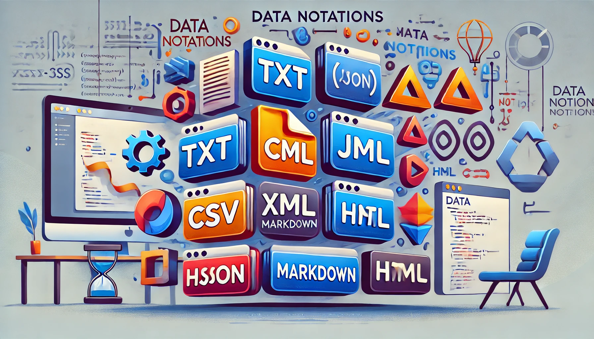

The Data Notations course is designed to introduce students to the most widely used data formats and notations in modern computing. The course covers the basics of each format, its use cases, and practical applications across various domains.

Main Topics:

* TXT: Understanding plain text files and their role in data storage and processing.
* CSV: Introduction to Comma-Separated Values, ideal for tabular data and widely used in spreadsheets and databases.
* XML: Explore Extensible Markup Language, commonly used for data interchange and document structures.
* JSON: Learn about JavaScript Object Notation, a lightweight data-interchange format commonly used in web applications.
* Markdown: Discover the simplicity of Markdown, often used in writing content for the web and documentation.
* HTML: Basics of HyperText Markup Language for structuring web pages and representing content online.
* CSS: Cascading Style Sheets for styling and visually enhancing web content.

By the end of the course, students will be familiar with the strengths, limitations, and appropriate usage scenarios for each data format, equipping them with the skills necessary to work with diverse data in real-world environments.
